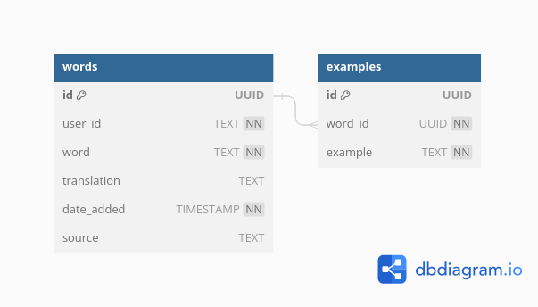

# 知识 - A simple CRUD service for (Chinese) vocabulary

知识 is a CRUD service for vocabulary, written in Rust with Axum and Diesel. Together with the [Frontend](https://github.com/Toth23/vocab_frontend), it provides an easy way to record all newly learned words, optionally together with translation and example sentences.

While developed specifically for Chinese, it can also be used for other languages.

## Data model

A word can have any number of examples. The `translation` and `source` fields are optional, while `date_added` is set automatically.



## Technologies

The following technologies are used:

- [Rust](https://www.rust-lang.org/) programming language
- [Axum](https://github.com/tokio-rs/axum) as web application framework
- [Diesel](https://diesel.rs/) for database interactions (ORM), with [Deadpool](https://docs.rs/deadpool/latest/deadpool/) as connection pool
- [Serde](https://serde.rs/) for (de-)serialization
- [PostgreSQL](https://www.postgresql.org/) database
- [Reqwest](https://docs.rs/reqwest/latest/reqwest/) for integration testing
- [Fly.io](https://fly.io/) for the deployed instance

## Request authentication

To not require any sign-up, but still provide some basic user segregation, each request must set the custom `x-user-identifier` request header. It can contain any string, and the response will only contain data associated with that user id. 

## Integration tests

Integration tests are written at [tests/integration_tests.rs](tests/integration_tests.rs). These tests require a local Postgres database, which is provided by running [test-database/docker-compose.yml](test-database/docker-compose.yml):
```shell
cd test-database
docker-compose up
```
The database is cleaned before each test, hence they need to run sequentially:
```shell
cargo test -- --test-threads 1
```

## Local development setup
- Start a local Postgres database, e.g. in a docker container:
```shell
docker run --name postgres-vocab -e POSTGRES_USER=my-user -e POSTGRES_PASSWORD=my-password -e POSTGRES_DB=vocab -d -p 5432:5432 postgres:latest
```
- Connect to the database and install the `uuid-ossp` extension:
```sql
CREATE EXTENSION IF NOT EXISTS "uuid-ossp";
```
- Create a `.env` file from the template (adjust variables as required)
```shell
cp .env-template .env
```
- Run the migrations to create the tables:
```shell
cargo install diesel_cli --no-default-features --features postgres
diesel migration run
```
- Start the application:
```shell
cargo run
```
